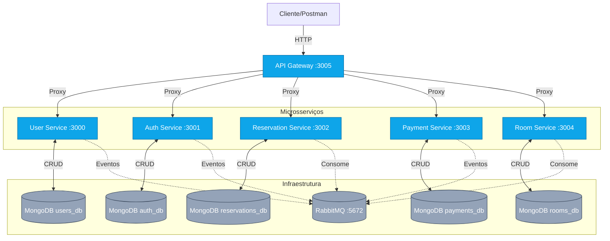

# 🏨 Hotel Management System

Sistema de gerenciamento hoteleiro baseado em microsserviços, orquestrados por API Gateway com comunicação REST e eventos assíncronos via RabbitMQ.

## 🚀 Tecnologias

<div align="center">


</div>

## ✨ Funcionalidades

- 🔐 Autenticação JWT com controle de permissões por papel (Admin, Receptionist, Guest)
- 👥 Gestão completa de usuários (hóspedes, recepcionistas, administradores)
- 🏠 Gerenciamento de quartos (tipos, status, manutenção)
- 📅 Sistema de reservas com validação de disponibilidade e conflitos
- 💳 Processamento de pagamentos com estratégias de desconto
- 📊 Relatórios de ocupação e faturamento
- 🔄 Comunicação assíncrona via eventos (RabbitMQ)
- 🏗️ Arquitetura limpa com princípios SOLID e padrões GoF
- ✅ Testes unitários e de integração

## 📁 Estrutura do Projeto

```
hotel-management-system/
├── services/
│   ├── gateway/           # API Gateway (porta 3005)
│   ├── user/             # Serviço de usuários (porta 3000)
│   ├── auth/             # Serviço de autenticação (porta 3001)
│   ├── reservation/      # Serviço de reservas (porta 3002)
│   ├── payment/          # Serviço de pagamentos (porta 3003)
│   └── room/             # Serviço de quartos (porta 3004)
├── docker-compose.yml    # Orquestração dos serviços
└── README.md
```

## 🏗️ Arquitetura

### Visão Geral



### Serviços e Portas

| Serviço | Porta | Banco de Dados | Swagger UI |
|---------|-------|----------------|------------|
| **Gateway** | 3005 | - | `http://localhost:3005/docs` |
| **User** | 3000 | `users_db` | `http://localhost:3000/docs` |
| **Auth** | 3001 | `auth_db` | `http://localhost:3001/docs` |
| **Reservation** | 3002 | `reservations_db` | `http://localhost:3002/docs` |
| **Payment** | 3003 | `payments_db` | `http://localhost:3003/docs` |
| **Room** | 3004 | `rooms_db` | `http://localhost:3004/docs` |
| **RabbitMQ** | 5672 / 15672 | - | `http://localhost:15672` |

> **Nota**: Cada serviço possui seu próprio banco de dados isolado, seguindo o padrão de microsserviços.

## 🔌 Endpoints da API

**Base URL**: `http://localhost:3005` (via API Gateway)

### 🔓 Públicos (sem autenticação)

#### Auth Service
```http
POST /api/login              # Autenticação de usuário
POST /api/validate           # Validação de token JWT
```

#### User Service
```http
POST /api/self-register      # Auto-cadastro de hóspede
```

### 🔒 Protegidos (requerem JWT)

#### User Service
```http
POST   /api/register         # Criar usuário (admin/receptionist)
GET    /api/users            # Listar usuários
GET    /api/users/{id}       # Obter usuário por ID
PUT    /api/users/{id}       # Atualizar usuário
DELETE /api/users/{id}       # Remover usuário
```

#### Room Service
```http
GET    /api/rooms            # Listar quartos
POST   /api/rooms            # Criar quarto
GET    /api/rooms/{id}       # Obter quarto por ID
PUT    /api/rooms/{id}       # Atualizar quarto
DELETE /api/rooms/{id}       # Remover quarto
PATCH  /api/rooms/{id}/status # Atualizar status do quarto
```

#### Reservation Service
```http
GET    /api/reservations     # Listar reservas
POST   /api/reservations     # Criar reserva
GET    /api/reservations/{id} # Obter reserva por ID
PUT    /api/reservations/{id} # Atualizar reserva
DELETE /api/reservations/{id} # Cancelar reserva
POST   /api/reservations/{id}/checkin  # Realizar check-in
POST   /api/reservations/{id}/checkout # Realizar check-out
```

#### Payment Service
```http
GET    /api/payments         # Listar pagamentos
POST   /api/payments         # Processar pagamento
GET    /api/payments/{id}    # Obter pagamento por ID
GET    /api/payments/{id}/status # Consultar status do pagamento
```

## 🎯 Permissões por Papel

<div align="center">

| Ação | Admin | Receptionist | Guest |
|------|:-----:|:------------:|:-----:|
| Auto-cadastro | ✗ | ✗ | ✓ |
| Cadastrar hóspede | ✓ | ✓ | ✗ |
| Gerenciar reservas | ✓ | ✓ | ✗ |
| Gerenciar quartos | ✓ | ✓ | ✗ |
| Consultar relatórios | ✓ | ✓ | ✗ |
| Processar pagamento | ✓ | ✓ | ✗ |
| Check-in/Check-out | ✓ | ✓ | ✗ |
| Cancelar reserva | ✓ | ✓ | ✗ |

</div>

## ⚙️ Configuração

### Pré-requisitos
- Docker & Docker Compose
- Node.js 18+ (para desenvolvimento local)
- MongoDB Atlas (conta gratuita)

### Variáveis de Ambiente

Crie um arquivo `.env.local` na raiz do projeto:

```ini
MONGODB_URI=mongodb+srv://<usuario>:<senha>@<cluster>/<database>?retryWrites=true&w=majority
JWT_SECRET=seu_segredo_super_seguro_aqui_minimo_32_caracteres
RABBITMQ_URL=amqp://rabbitmq:5672
```

> **⚠️ Importante**: Nunca commite o arquivo `.env.local` no repositório.

## 🚀 Executando o Projeto

### Com Docker (Recomendado)

```powershell
# Subir todos os serviços
docker compose up --build

# Rodar em background
docker compose up -d --build

# Parar todos os serviços
docker compose down
```

### Localmente (Desenvolvimento)

```powershell
# Exemplo: rodar apenas o User Service
cd services/user
npm install
npm start

# O serviço estará disponível em http://localhost:3000
```

## 🧪 Testando a API

### Exemplo de Fluxo Completo (PowerShell)

```powershell
# 1. Auto-cadastro de hóspede
$guest = @{
    name = "Alice Silva"
    email = "alice@example.com"
    document = "12345678901"
    password = "Senha@123"
    role = "guest"
} | ConvertTo-Json

Invoke-RestMethod -Uri "http://localhost:3005/api/self-register" `
    -Method Post -ContentType "application/json" -Body $guest

# 2. Login
$login = @{
    username = "alice@example.com"
    password = "Senha@123"
} | ConvertTo-Json

$response = Invoke-RestMethod -Uri "http://localhost:3005/api/login" `
    -Method Post -ContentType "application/json" -Body $login

$token = $response.token

# 3. Listar quartos disponíveis
$headers = @{ Authorization = "Bearer $token" }

Invoke-RestMethod -Uri "http://localhost:3005/api/rooms" `
    -Headers $headers -Method Get

# 4. Criar reserva
$reservation = @{
    roomId = "675a1b2c3d4e5f6g7h8i9j0k"
    guestId = "675a1b2c3d4e5f6g7h8i9j0l"
    checkIn = "2025-12-01"
    checkOut = "2025-12-05"
} | ConvertTo-Json

Invoke-RestMethod -Uri "http://localhost:3005/api/reservations" `
    -Headers $headers -Method Post -ContentType "application/json" -Body $reservation
```

## 🧪 Testes

### Executar Todos os Testes

```powershell
# Rodar testes de todos os serviços via Docker
docker compose up --build --abort-on-container-exit
```

### Testes por Serviço

```powershell
# User Service
cd services/user
npm install
npm test

# Auth Service
cd services/auth
npm test

# Room Service
cd services/room
npm test

# Reservation Service
cd services/reservation
npm test

# Payment Service
cd services/payment
npm test

# Gateway
cd services/gateway
npm test
```

### Cobertura de Código

```powershell
# Gerar relatório de cobertura
cd services/<nome-do-serviço>
npm run coverage

# O relatório estará em: coverage/lcov-report/index.html
```

## 🏛️ Padrões e Princípios

### Clean Architecture
- Separação clara entre camadas: Domain, Application, Infrastructure, Interfaces
- Independência de frameworks e ferramentas externas
- Testabilidade isolada de cada camada

### Princípios SOLID
- **S**ingle Responsibility: cada classe/módulo tem uma única responsabilidade
- **O**pen/Closed: aberto para extensão, fechado para modificação
- **L**iskov Substitution: substituição sem quebrar funcionalidade
- **I**nterface Segregation: interfaces específicas e enxutas
- **D**ependency Inversion: dependa de abstrações, não de implementações

### Padrões GoF Aplicados

<div align="center">

| Padrão | Exemplo | Localização |
|--------|---------|-------------|
| **Repository** | Abstração de persistência | `services/user/src/infrastructure/UserRepository.js` |
| **Service** | Lógica de negócio | `services/reservation/src/application/ReservationService.js` |
| **Factory** | Criação de entidades | `services/room/src/domain/RoomFactory.js` |
| **Strategy** | Estratégias de pagamento | `services/payment/src/domain/strategy/PaymentStrategy.js` |

</div>

## 🩺 Health Check

Todos os serviços expõem um endpoint de saúde:

```http
GET /health
```

**Resposta**:
```json
{
  "status": "healthy",
  "service": "user-service",
  "uptime": 3600,
  "timestamp": "2025-11-23T10:30:00.000Z"
}
```

## 🐰 RabbitMQ Management

Acesse o console de gerenciamento do RabbitMQ:

- **URL**: `http://localhost:15672`
- **Usuário**: `guest`
- **Senha**: `guest`

## 🔧 Solução de Problemas

### Erro de conexão com MongoDB
- Verifique se `MONGODB_URI` está configurado corretamente no `.env.local`
- Confirme que seu IP está liberado no MongoDB Atlas
- Teste a conexão diretamente via MongoDB Compass

### Erro 401/403 em rotas protegidas
- Verifique se o token JWT está sendo enviado no header: `Authorization: Bearer <token>`
- Confirme que o usuário tem a permissão (role) adequada para a operação
- Valide se o token não expirou (POST /api/validate)

### Porta já em uso
- Altere as portas no `docker-compose.yml`
- Ou finalize o processo que está usando a porta: `netstat -ano | findstr :3005`

### RabbitMQ indisponível
- Aguarde o health check ficar verde (pode levar ~30s)
- Verifique os logs: `docker compose logs rabbitmq`
- Reinicie o container: `docker compose restart rabbitmq`


<div align="center">
  <p>Desenvolvido para a disciplina 85ESE (Engenharia de Software Orientada a Serviços) da UDESC</p>
</div>
