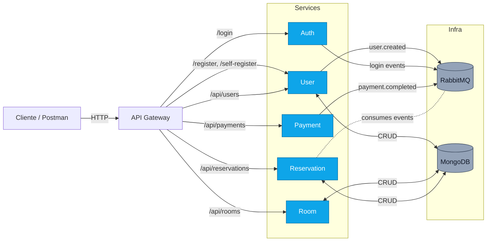
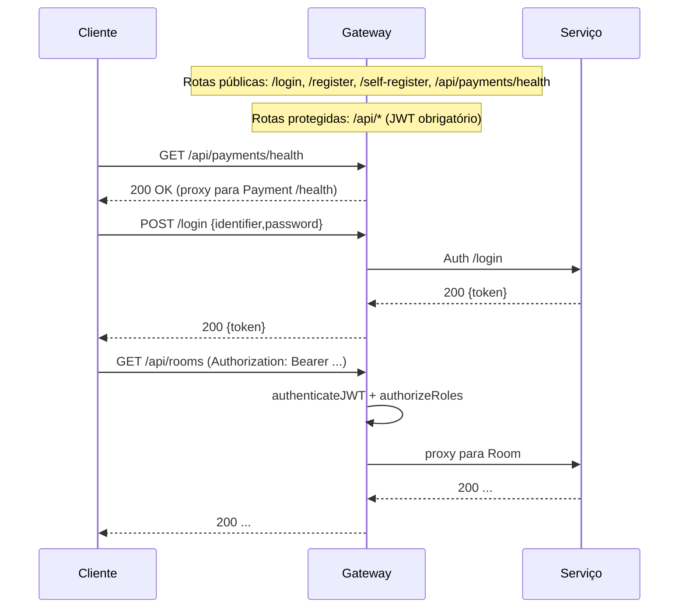
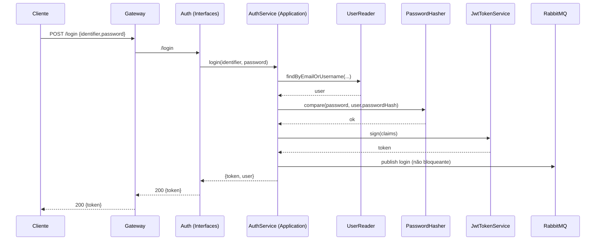
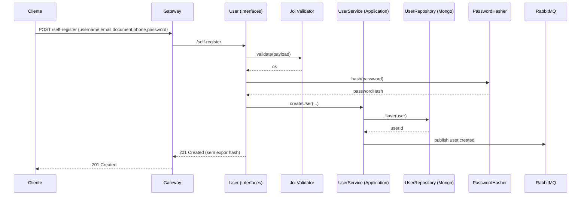
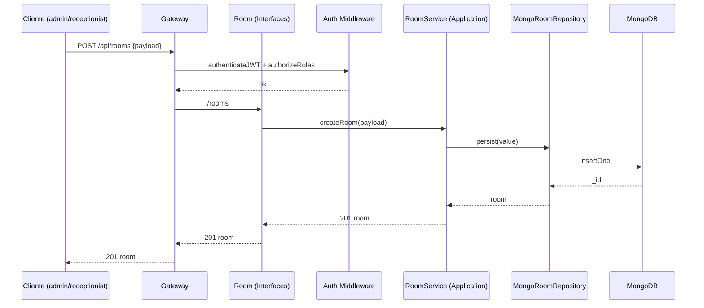
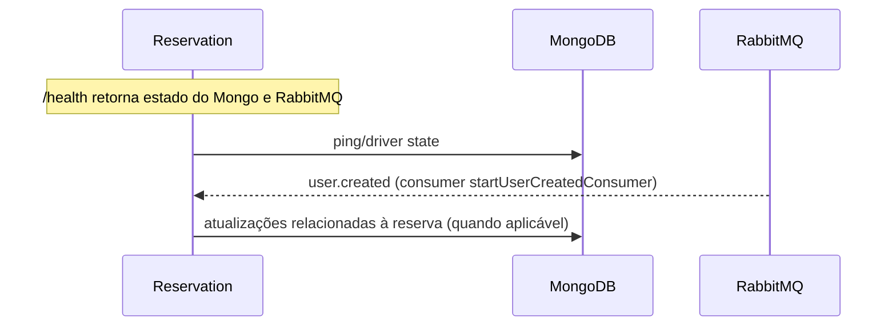
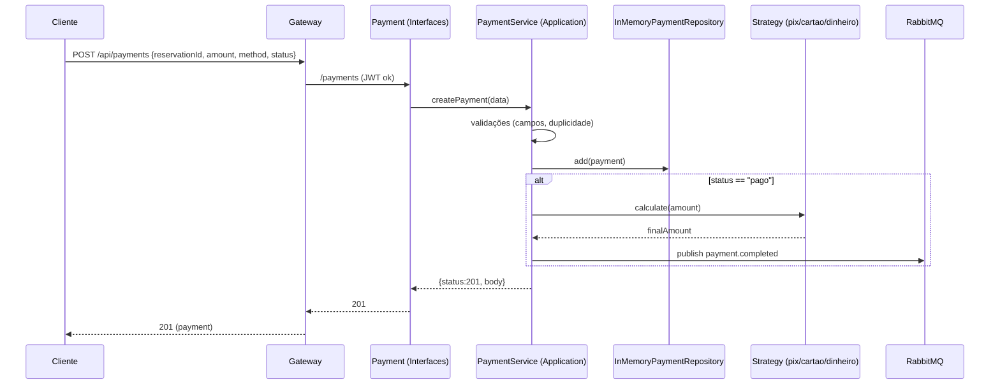

# 🏨 Hotel Management System

Este repositório contém um conjunto de microsserviços orquestrados por um API Gateway. Para uma visão detalhada da arquitetura, comunicação, princípios SOLID, padrões de projeto e estratégia de testes, consulte:

<a href="https://nodejs.org/" target="_blank"></a>
<a href="https://expressjs.com/" target="_blank"></a>
<a href="https://www.docker.com/" target="_blank"></a>
<a href="https://www.rabbitmq.com/" target="_blank"></a>
<a href="https://jestjs.io/" target="_blank"></a>
<a href="https://github.com/jest-community/supertest" target="_blank"></a>
<a href="https://axios-http.com/" target="_blank"></a>
<a href="https://jwt.io/" target="_blank"></a>
<a href="https://restfulapi.net/" target="_blank"></a>
<a href="https://en.wikipedia.org/wiki/SOLID" target="_blank"></a>

<div align="center">

  
  

<br>
  <br/>

  
  

</div>

</div>


## ✨ Principais Funcionalidades

- Gestão de hóspedes, recepcionistas e administradores com permissões distintas
- API Gateway centralizando entrada, autenticação e proxy
- Cadastro e autenticação de usuários (JWT)
- Gerenciamento de quartos (criação, edição, remoção, tipos, manutenção)
- Reservas com validação de disponibilidade, datas e regras de negócio
- Pagamento de reservas com aplicação de descontos (Strategy Pattern)
- Check-in e check-out controlados por regras e status
- Relatórios de ocupação, faturamento e auditoria
- Comunicação entre microsserviços via REST e eventos assíncronos (RabbitMQ)
- Arquitetura limpa, SOLID e padrões GoF aplicados
- Testes unitários e de integração por serviço; cobertura em `docs/arquitetura.md`

## Estrutura do Projeto

```text
hotel-management-system/
├── services/           # Microsserviços (user, auth, room, reservation, payment, gateway)
│   └── .../tests/      # Cada serviço contém seus próprios testes (unit/integration)
├── docker-compose.yml  # Orquestração dos serviços e mensageria (sem Mongo container)
└── README.md           # Este guia
```

## Executando (resumo)

PowerShell (Windows):

```powershell
docker compose up -d --build
```

Testes no gateway dentro do container:

```powershell
docker compose exec gateway npm test -- --testPathPattern=gatewayHealth.test.js
docker compose exec gateway npm test
```

## Rodando Localmente (sem Docker)

Quando quiser focar em um único serviço localmente (PowerShell):

```powershell
# 1) Defina variáveis locais (ou crie .env.local na raiz)
$env:MONGODB_URI = "mongodb+srv://<usuario>:<senha>@<cluster>/<db>?retryWrites=true&w=majority"
$env:JWT_SECRET = "altere_este_valor_no_seu_ambiente"
$env:RABBITMQ_URL = "amqp://localhost:5672"  # opcional, somente se usar mensageria local

# 2) Suba o serviço desejado
cd services/user; npm install; npm start
```

Observações:
- Em DEV não há container de Mongo; use uma URI do Atlas.
- Para mensageria local, suba um RabbitMQ local ou rode `docker compose up rabbitmq`.
- O API Gateway depende dos demais serviços para responder às rotas proxy.

## 🏗️ Microsserviços

| Microsserviço | Função |
| ------------ | ------ |
| **gateway** | Entrada única; autenticação e proxy para os microsserviços. |
| **user** | Gerencia usuários/hóspedes, cadastro, validações (CPF/RG), perfis e integração com Auth. |
| **reservation** | Controla reservas (datas, disponibilidade), conflitos, cancelamentos; integra com Room/Payment. |
| **room** | Gerencia quartos, tipos e status (livre/ocupado/manutenção), atendendo o Reservation. |
| **payment** | Processa pagamentos, aplica descontos (Strategy), valida status e registra transações. |
| **auth** | Autenticação, geração/validação de JWT, login e integração com User. |

## 🗂️ Status dos Serviços (Docker)

| Serviço      | Porta Host -> Container | Endpoint Principal         | Status |
|--------------|--------------------------|----------------------------|--------|
| gateway      | 3005 -> 3005             | /, /health                 | OK     |
| user         | 3000 -> 3000             | /users, /register          | OK     |
| auth         | 3001 -> 3001             | /login, /validate          | OK     |
| reservation  | 3002 -> 3000             | /reservations              | OK     |
| payment      | 3003 -> 3003             | /payments                  | OK     |
| room         | 3004 -> 3004             | /rooms                     | OK     |
| RabbitMQ     | 5672/15672               | AMQP/HTTP (console)        | OK     |

## 🎯 Permissões por Papel

| Ação                  | Admin | Receptionist | Guest |
|-----------------------|:-----:|:------------:|:-----:|
| Auto-cadastro         | ✗ | ✗ | ✓ |
| Cadastrar hóspede     | ✓ | ✓ | ✗ |
| Gerenciar reservas    | ✗ | ✓ | ✗ |
| Gerenciar quartos     | ✓ | ✓ | ✗ |
| Consultar relatórios  | ✓ | ✓ | ✗ |
| Efetuar pagamento     | ✓ | ✓ | ✗ |
| Check-in/out          | ✓ | ✓ | ✗ |
| Cancelar reserva      | ✗ | ✓ | ✗ |

## 🏛️ Padrões de Arquitetura

- Clean Architecture: separação clara entre camadas (Domain, Application, Infrastructure, Interfaces). Exemplos por serviço.
- GoF Patterns: Repository, Service, Factory e Strategy. Exemplos reais:
  - Repository: `services/user/src/infrastructure/UserRepository.js`
  - Service: `services/reservation/src/application/ReservationService.js`
  - Factory: `services/room/src/domain/RoomFactory.js`
  - Strategy: `services/payment/src/domain/strategy/PaymentStrategy.js`
- SOLID: foco em responsabilidade única e extensibilidade (ex.: novos métodos de pagamento sem alterar o core).
- Docker: cada microserviço em seu container; orquestração via `docker-compose.yml`.
- Mensageria: RabbitMQ para eventos e comunicação assíncrona (amqplib).

## 📈 Diagramas 

### Visão Geral (Arquitetura)



### Gateway — Roteamento e Autenticação



### Auth — Login e Emissão de JWT



### User — Auto Cadastro (Self-Register)



### Room — Criação de Quarto (Protegido)



### Reservation — Health e Consumer de Eventos



### Payment — Criação e Descontos (Strategy)



## 🔑 Variáveis de ambiente

Crie um arquivo `.env.local` na raiz (baseado em `.env.local.sample`) com:

```ini
MONGODB_URI=mongodb+srv://<usuario>:<senha>@<cluster>/<database>?retryWrites=true&w=majority
JWT_SECRET=altere_este_valor_no_seu_ambiente
```

Observações:

- Não usamos container de Mongo; a URI deve ser do Atlas.
- RabbitMQ é fornecido pelo docker compose; entre containers use `amqp://rabbitmq`.
- Em DEV há fallback de JWT_SECRET no compose, mas recomendo definir no `.env.local`.

## 🚀 Como Executar o Projeto (Docker)

Na raiz do projeto, execute no PowerShell:

```powershell
# Build + subir todos os serviços
docker compose up --build

# Dica: em versões antigas do Docker, use 'docker-compose'
# docker-compose up --build
```

Após os health checks ficarem verdes:

- Gateway: <http://localhost:3005>
- RabbitMQ UI: <http://localhost:15672> (guest/guest)

## 🧭 Fluxo rápido (via API Gateway)

Endpoints principais do gateway:

- POST /register -> User Service
- POST /login -> Auth Service
- GET /validate -> valida JWT (Auth)
- Rotas protegidas: /users, /reservations, /rooms, /payments

Exemplos (PowerShell):

```powershell
# 1) Registrar um hóspede
$body = @{ name = 'Alice'; email = 'alice@example.com'; document = '12345678901'; password = 'Str0ng@Pass'; role = 'guest' } | ConvertTo-Json
Invoke-RestMethod -Uri 'http://localhost:3005/register' -Method Post -ContentType 'application/json' -Body $body

# 2) Login
$login = @{ username = 'alice@example.com'; password = 'Str0ng@Pass' } | ConvertTo-Json
$resp = Invoke-RestMethod -Uri 'http://localhost:3005/login' -Method Post -ContentType 'application/json' -Body $login
$token = $resp.token

# 3) Validar token
Invoke-RestMethod -Uri 'http://localhost:3005/validate' -Headers @{ Authorization = "Bearer $token" } -Method Get

# 4) Rota protegida (ex.: quartos)
Invoke-RestMethod -Uri 'http://localhost:3005/rooms' -Headers @{ Authorization = "Bearer $token" } -Method Get
```

Se preferir curl (Windows):

```powershell
curl.exe -s -X POST http://localhost:3005/login -H "Content-Type: application/json" -d '{"username":"alice@example.com","password":"Str0ng@Pass"}' | ConvertFrom-Json
```

## 🧪 Executando os testes

Todos os serviços via Docker Compose (encerra quando os testes acabam):

```powershell
docker compose up --build --abort-on-container-exit --remove-orphans
```

Unit test por serviço (ex.: user):

```powershell
cd services/user
npm install
npm test
```

Notas:

- Testes usam ESM/Jest; alguns serviços têm setupFilesAfterEnv.
- Logs ruidosos sanitizados; erros em pt-BR.

### Cobertura por Serviço (Windows)

Use os comandos abaixo em cada pasta `services/<nome>`:

```powershell
# auth
cd services/auth; npm install; npm run coverage

# user
cd services/user; npm install; npm run coverage

# room
cd services/room; npm install; npm run coverage

# reservation
cd services/reservation; npm install; node --experimental-vm-modules ./node_modules/jest/bin/jest.js --config=jest.config.mjs --coverage

# payment
cd services/payment; npm install; npm test   # já inclui --coverage no script

# gateway
cd services/gateway; npm install; node --experimental-vm-modules ./node_modules/jest/bin/jest.js --config=jest.config.mjs --coverage
```

- Relatórios são gerados em `services/<nome>/coverage`.
- Números consolidados e instruções detalhadas: veja `docs/arquitetura.md` (seção Testes e Cobertura).

## 🩺 Health e observabilidade

- GET `/health` em cada serviço retorna JSON com status, uptime e (em dev) origem das variáveis de segredo.
- RabbitMQ console: <http://localhost:15672> (guest/guest).

## 🛠️ Solução de problemas (FAQ rápido)

- Erro de conexão com Mongo: verifique `MONGODB_URI` no `.env.local` (Atlas) e liberação de IPs no cluster.
- 401/403 em rotas protegidas: confira `Authorization: Bearer <token>` e a role do usuário.
- Porta em uso: ajuste as portas no `docker-compose.yml` ou pare processos locais.
- RabbitMQ indisponível: aguarde o health check ficar verde; veja logs do serviço.
- `cross-env` não encontrado: rode `npm install` no serviço antes dos testes.
- `mongodb-memory-server` demorando no primeiro teste: é normal (download de binários do Mongo para testes).

## 🤝 Contribuição

Contribuições são bem-vindas! Abra issues ou pull requests. Antes de enviar, rode os testes do serviço impactado.


