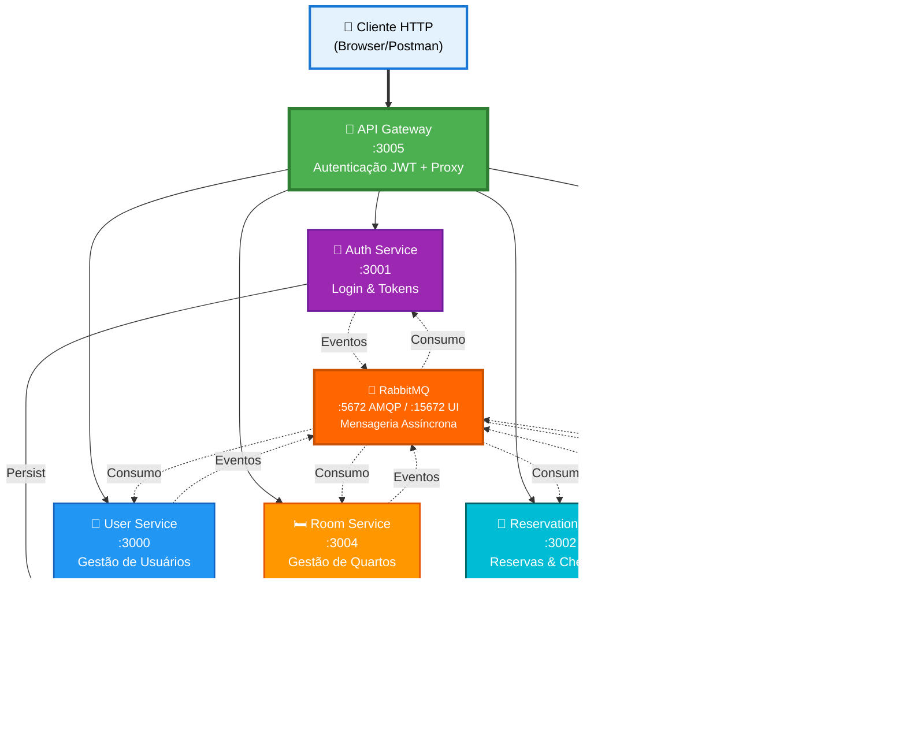
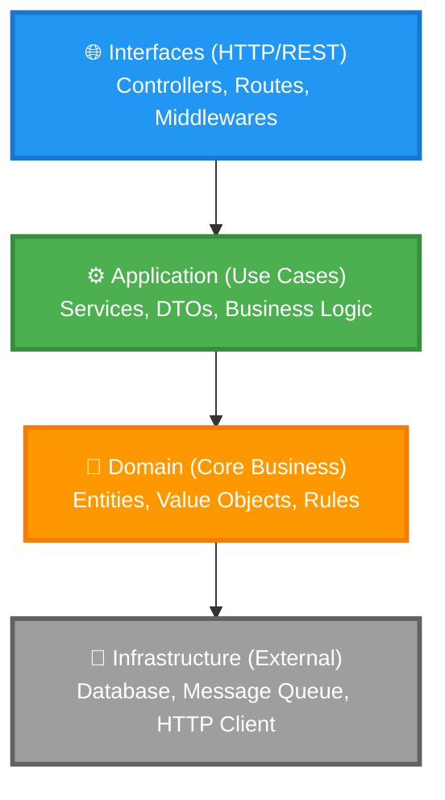

# 🏨 Hotel Management System

<div align="center">

[](https://nodejs.org/)
[](https://expressjs.com/)
[](https://www.mongodb.com/)
[](https://www.docker.com/)
[](https://www.rabbitmq.com/)

**Sistema completo de gerenciamento hoteleiro com arquitetura de microsserviços**

[](#)
[](#)
[](#)

[Sobre](#-sobre) • [Funcionalidades](#-funcionalidades) • [Arquitetura](#-arquitetura) • [Instalação](#-instalação) • [Uso](#-uso) • [Testes](#-testes)

</div>

---

## 🎯 Sobre

Sistema orientado a serviços para **gerenciamento completo de hotel**, possibilitando a gestão de reservas, quartos, hóspedes, recepcionistas e pagamentos através de uma arquitetura moderna de microsserviços.

### Principais Diferenciais

| Característica | Descrição |
|----------------|-----------|
| 🏛️ **Clean Architecture** | Arquitetura limpa em todos os microsserviços |
| 📐 **SOLID** | Princípios SOLID rigorosamente aplicados |
| 🎨 **Padrões GoF** | 7 padrões implementados (Proxy, Chain, Adapter, Observer, Strategy, Factory, Facade) |
| 🚪 **API Gateway** | Ponto único de entrada com autenticação JWT |
| 🔄 **Mensageria** | Comunicação assíncrona via RabbitMQ |
| 🔐 **Segurança** | Autenticação JWT com controle de roles |

---

## ✨ Funcionalidades

<table>
<tr>
<td width="33%" valign="top">

### 👤 Gestão de Usuários
- Auto-cadastro de hóspedes
- Cadastro por staff
- Autenticação JWT
- Controle de permissões
- Validação CPF/RG

</td>
<td width="33%" valign="top">

### 🛏️ Gestão de Quartos
- CRUD completo
- Tipos: Single, Double, Suite
- Status: Available, Occupied, Maintenance
- Validação de disponibilidade
- Controle de preços

</td>
<td width="33%" valign="top">

### 📅 Gestão de Reservas
- Criar com validação
- Prevenir overbooking
- Validar datas
- Cancelamento
- Integração com pagamentos

</td>
</tr>
<tr>
<td width="33%" valign="top">

### 💰 Pagamentos
- Cartão, PIX, Dinheiro
- Strategy Pattern
- Validação de status
- Confirmação assíncrona
- Integração com reservas

</td>
<td width="33%" valign="top">

### ✅ Check-in/Check-out
- Check-in para reservas pagas
- Atualização automática
- Sincronização via eventos
- Liberação de quartos
- Validações de fluxo

</td>
<td width="33%" valign="top">

### 📊 Relatórios
- Relatórios de ocupação
- Relatórios de faturamento
- Relatórios de auditoria
- Filtros por período
- Acesso restrito a staff

</td>
</tr>
</table>

---

## 🏗️ Arquitetura

### Visão Geral dos Microsserviços


```mermaid
graph TB
    Client["👤 Cliente HTTP<br/>(Browser/Postman)"]
    Gateway["🚪 API Gateway<br/>:3005<br/>Autenticação JWT + Proxy"]
    
    Auth["🔐 Auth Service<br/>:3001<br/>Login & Tokens"]
    User["👥 User Service<br/>:3000<br/>Gestão de Usuários"]
    Room["🛏️ Room Service<br/>:3004<br/>Gestão de Quartos"]
    Reservation["📅 Reservation Service<br/>:3002<br/>Reservas & Check-in/out"]
    Payment["💳 Payment Service<br/>:3003<br/>Pagamentos & Descontos"]
    
    RabbitMQ["🐰 RabbitMQ<br/>:5672 AMQP / :15672 UI<br/>Mensageria Assíncrona"]
    MongoDB[("💾 MongoDB Atlas<br/>Cloud Database<br/>Persistência")]
    
    Client ==> Gateway
    
    Gateway --> Auth
    Gateway --> User
    Gateway --> Room
    Gateway --> Reservation
    Gateway --> Payment
    
    Auth -.->|Eventos| RabbitMQ
    User -.->|Eventos| RabbitMQ
    Room -.->|Eventos| RabbitMQ
    Reservation -.->|Eventos| RabbitMQ
    Payment -.->|Eventos| RabbitMQ
    
    RabbitMQ -.->|Consumo| Auth
    RabbitMQ -.->|Consumo| User
    RabbitMQ -.->|Consumo| Room
    RabbitMQ -.->|Consumo| Reservation
    RabbitMQ -.->|Consumo| Payment
    
    Auth -->|Persist| MongoDB
    User -->|Persist| MongoDB
    Room -->|Persist| MongoDB
    Reservation -->|Persist| MongoDB
    Payment -->|Persist| MongoDB
    
    style Client fill:#E3F2FD,stroke:#1976D2,stroke-width:3px,color:#000
    style Gateway fill:#4CAF50,stroke:#2E7D32,stroke-width:4px,color:#fff,font-size:16px
    style RabbitMQ fill:#FF6600,stroke:#CC5200,stroke-width:3px,color:#fff,font-size:14px
    style MongoDB fill:#47A248,stroke:#13AA52,stroke-width:3px,color:#fff,font-size:14px
    style Auth fill:#9C27B0,stroke:#6A1B9A,stroke-width:2px,color:#fff
    style User fill:#2196F3,stroke:#1565C0,stroke-width:2px,color:#fff
    style Room fill:#FF9800,stroke:#E65100,stroke-width:2px,color:#fff
    style Reservation fill:#00BCD4,stroke:#006064,stroke-width:2px,color:#fff
    style Payment fill:#F44336,stroke:#B71C1C,stroke-width:2px,color:#fff
```

### 📦 Detalhamento dos Microsserviços

| Serviço | Porta | Responsabilidade |
|---------|-------|------------------|
| **gateway** | 3005 | Ponto único de entrada; autenticação JWT; proxy HTTP |
| **user** | 3000 | CRUD de usuários; validação CPF/RG; gestão de perfis |
| **auth** | 3001 | Autenticação; geração/validação JWT; login |
| **room** | 3004 | CRUD de quartos; tipos e status; disponibilidade |
| **reservation** | 3002 | CRUD de reservas; check-in/out; validações |
| **payment** | 3003 | Processamento de pagamentos; descontos |

### 🔄 Comunicação Entre Serviços

| Tipo | Tecnologia | Uso |
|------|------------|-----|
| **Síncrona** | REST/HTTP + JSON | Cliente → Gateway → Microsserviços |
| **Assíncrona** | RabbitMQ (AMQP) | Eventos entre serviços (user.created, payment.completed, etc) |

### 🎨 Padrões Arquiteturais

#### Clean Architecture


```mermaid
graph TB
    A["🌐 Interfaces (HTTP/REST)<br/>Controllers, Routes, Middlewares"] 
    B["⚙️ Application (Use Cases)<br/>Services, DTOs, Business Logic"]
    C["💼 Domain (Core Business)<br/>Entities, Value Objects, Rules"]
    D["🔧 Infrastructure (External)<br/>Database, Message Queue, HTTP Client"]
    
    A --> B
    B --> C
    C --> D
    
    style A fill:#2196F3,stroke:#1976D2,stroke-width:3px,color:#fff,font-size:14px
    style B fill:#4CAF50,stroke:#388E3C,stroke-width:3px,color:#fff,font-size:14px
    style C fill:#FF9800,stroke:#F57C00,stroke-width:3px,color:#fff,font-size:14px
    style D fill:#9E9E9E,stroke:#616161,stroke-width:3px,color:#fff,font-size:14px
```

#### Princípios SOLID

| Princípio | Sigla | Aplicação no Projeto |
|-----------|-------|---------------------|
| **Single Responsibility** | SRP | Middlewares separados (auth/authz/logging) |
| **Open/Closed** | OCP | Configuração extensível via variáveis de ambiente |
| **Liskov Substitution** | LSP | Contratos de repositório substituíveis |
| **Interface Segregation** | ISP | Interfaces específicas por agregado |
| **Dependency Inversion** | DIP | Injeção de dependências via construtor |

### 🎯 Padrões GoF Implementados

| Padrão | Localização | Propósito |
|--------|-------------|-----------|
| **Proxy** | `gateway/` | Intermediação HTTP; controle transversal |
| **Chain of Responsibility** | `gateway/middlewares/` | Pipeline CORS → Auth → Authz → Proxy |
| **Adapter** | `*/infrastructure/*Repository.js` | Adaptação MongoDB/HTTP/MQ → Domain |
| **Observer** | `*/rabbitmq/` | Pub/Sub de eventos assíncronos |
| **Strategy** | `payment/strategy/` | Políticas de desconto por método |
| **Factory** | `room/domain/RoomFactory.js` | Criação parametrizada de quartos |
| **Facade** | `gateway/` | Unificação de APIs internas |

---

## 🛠️ Tecnologias

| Categoria | Tecnologias |
|-----------|-------------|
| **Runtime** | Node.js 20 LTS |
| **Framework** | Express.js |
| **Banco de Dados** | MongoDB Atlas + Mongoose |
| **Mensageria** | RabbitMQ (amqplib) |
| **Autenticação** | JWT (jsonwebtoken) + bcrypt |
| **Testes** | Jest + Supertest + mongodb-memory-server |
| **Containerização** | Docker + Docker Compose |
| **Proxy/Gateway** | http-proxy-middleware |
| **HTTP Client** | Axios |
| **Logs** | Morgan |

---

## 📋 Requisitos

### Ambiente de Desenvolvimento

| Requisito | Versão Mínima |
|-----------|---------------|
| **Windows** | 10/11 com PowerShell 5.1+ |
| **Docker Desktop** | 4.x com Docker Compose |
| **Node.js** | 20 LTS (opcional para testes locais) |
| **MongoDB Atlas** | Conta ativa com cluster configurado |

### Variáveis de Ambiente

Crie `.env.local` na raiz do projeto:

```env
# MongoDB Atlas (OBRIGATÓRIO - sem container local)
MONGODB_URI=mongodb+srv://<usuario>:<senha>@<cluster>/<database>?retryWrites=true&w=majority

# JWT Secret (altere em produção)
JWT_SECRET=seu_secret_super_seguro_min_32_chars
```

> ⚠️ **IMPORTANTE:** O sistema **NÃO usa container de MongoDB**. É necessário usar MongoDB Atlas (cloud).

---

## 🚀 Instalação

### 1. Clone o Repositório

```bash
git clone https://github.com/nathalia-acordi/hotel-management-system.git
cd hotel-management-system
```

### 2. Configure MongoDB Atlas

| Passo | Ação |
|-------|------|
| 1 | Acesse [MongoDB Atlas](https://www.mongodb.com/cloud/atlas) |
| 2 | Crie um cluster gratuito |
| 3 | Configure usuário e senha |
| 4 | Adicione seu IP à whitelist |
| 5 | Copie a connection string |
| 6 | Cole no `.env.local` como `MONGODB_URI` |

### 3. Inicie os Serviços

```powershell
# Build e start de todos os serviços
docker compose up --build

# Em background (detached)
docker compose up --build -d

# Ver logs de um serviço específico
docker compose logs -f gateway
```

### 4. Verifique o Health

Aguarde os health checks ficarem verdes (~30 segundos)

| Serviço | URL | Credenciais |
|---------|-----|-------------|
| **Gateway** | http://localhost:3005/health | - |
| **RabbitMQ UI** | http://localhost:15672 | guest / guest |

---

## 💻 Uso

### Fluxo Completo via PowerShell

```powershell
# ==========================================
# 1. AUTO-CADASTRO DE HÓSPEDE (UC01)
# ==========================================
$cadastro = @{
    name = 'Alice Silva'
    email = 'alice@hotel.com'
    document = '12345678901'
    phone = '47999999999'
    password = 'SenhaForte123!'
} | ConvertTo-Json

$hospede = Invoke-RestMethod -Uri 'http://localhost:3005/register' `
    -Method Post `
    -ContentType 'application/json' `
    -Body $cadastro

Write-Host "✅ Hóspede cadastrado: $($hospede.name)" -ForegroundColor Green

# ==========================================
# 2. LOGIN (UC02)
# ==========================================
$login = @{
    username = 'alice@hotel.com'
    password = 'SenhaForte123!'
} | ConvertTo-Json

$auth = Invoke-RestMethod -Uri 'http://localhost:3005/login' `
    -Method Post `
    -ContentType 'application/json' `
    -Body $login

$token = $auth.token
Write-Host "✅ Token JWT obtido" -ForegroundColor Green

# ==========================================
# 3. VALIDAR TOKEN
# ==========================================
$validacao = Invoke-RestMethod -Uri 'http://localhost:3005/validate' `
    -Method Get `
    -Headers @{ Authorization = "Bearer $token" }

Write-Host "✅ Token válido. Role: $($validacao.role)" -ForegroundColor Green

# ==========================================
# 4. LISTAR QUARTOS DISPONÍVEIS (UC04)
# ==========================================
$quartos = Invoke-RestMethod -Uri 'http://localhost:3005/api/rooms' `
    -Method Get `
    -Headers @{ Authorization = "Bearer $token" }

Write-Host "✅ Quartos disponíveis: $($quartos.Count)" -ForegroundColor Green
```

### Endpoints da API Gateway

| Método | Endpoint | Auth | Role | Descrição |
|--------|----------|------|------|-----------|
| GET | `/health` | ❌ | - | Health check |
| POST | `/register` | ❌ | - | Auto-cadastro de hóspede |
| POST | `/login` | ❌ | - | Autenticação |
| GET | `/validate` | ✅ | Qualquer | Validar token |
| * | `/api/users/*` | ✅ | admin, receptionist | Gerenciar usuários |
| * | `/api/rooms/*` | ✅ | admin, receptionist | Gerenciar quartos |
| * | `/api/reservations/*` | ✅ | admin, receptionist | Gerenciar reservas |
| POST | `/api/payments/*` | ✅ | admin, receptionist | Processar pagamentos |

### Usando cURL (Windows)

```bash
# Login
curl.exe -X POST http://localhost:3005/login ^
  -H "Content-Type: application/json" ^
  -d "{\"username\":\"alice@hotel.com\",\"password\":\"SenhaForte123!\"}"

# Listar quartos (substitua SEU_TOKEN)
curl.exe -X GET http://localhost:3005/api/rooms ^
  -H "Authorization: Bearer SEU_TOKEN_AQUI"
```

---

## 🧪 Testes

### Cobertura Atual (12/11/2025)

| Serviço | Statements | Branches | Functions | Lines | Status |
|---------|------------|----------|-----------|-------|--------|
| **auth** | 62.37% | 56.07% | 68.18% | 65.40% | 🟡 |
| **payment** | 66.66% | 76.19% | 65.21% | 66.29% | 🟢 |
| **reservation** | 46.44% | 56.21% | 37.77% | 47.88% | 🔴 |
| **gateway** | 54.54% | 62.50% | 63.63% | 54.54% | 🟡 |
| **room** | 49.25% | 36.36% | 47.82% | 53.06% | 🟡 |
| **user** | 40.30% | 43.10% | 36.06% | 40.75% | 🔴 |
| **MÉDIA** | **53.93%** | **55.24%** | **53.45%** | **54.65%** | 🟡 |

**Meta:** 75% (RNF06) | **Ferramentas:** Jest + Supertest + mongodb-memory-server

### Executar Testes

```powershell
# Todos os serviços via Docker (recomendado)
docker compose up --build --abort-on-container-exit --remove-orphans

# Teste unitário por serviço
cd services/user
npm install
npm test

# Com relatório de cobertura
npm test -- --coverage

# Visualizar relatório HTML
start coverage/index.html
```

### Estratégia de Testes

| Tipo | Descrição | Ferramentas |
|------|-----------|-------------|
| **Unitários** | Funções, classes, regras de negócio isoladas | Jest |
| **Integração** | Comunicação entre módulos de um serviço | Jest + Supertest |
| **E2E** | Fluxo completo Gateway → Serviços → Filas | Jest + Docker + RabbitMQ |

---

## 🎭 Permissões

| Operação | 👑 Admin | 📋 Receptionist | 🏠 Guest |
|----------|----------|-----------------|----------|
| Auto-cadastro | ❌ | ❌ | ✅ |
| Cadastrar hóspede | ✅ | ✅ | ❌ |
| Gerenciar usuários | ✅ | ❌ | ❌ |
| Criar/Editar/Remover quartos | ✅ | ✅ | ❌ |
| Criar reserva | ✅ | ✅ | ❌ |
| Cancelar reserva | ✅ | ✅ | ❌ |
| Processar pagamento | ✅ | ✅ | ❌ |
| Check-in/Check-out | ✅ | ✅ | ❌ |
| Consultar relatórios | ✅ | ✅ | ❌ |

---

## 🔧 Solução de Problemas

<details>
<summary><b>❌ Erro de conexão com MongoDB</b></summary>

**Causa:** URI inválida ou IP não liberado no Atlas

**Solução:**
1. Verifique `MONGODB_URI` no `.env.local`
2. No MongoDB Atlas: Network Access → Add IP Address → Add Current IP
3. Teste a conexão: `docker compose logs user`

</details>

<details>
<summary><b>❌ 401 Unauthorized em rotas protegidas</b></summary>

**Causa:** Token JWT ausente, inválido ou expirado

**Solução:**
1. Faça login novamente: `POST /login`
2. Verifique o header: `Authorization: Bearer <token>`
3. Valide o token: `GET /validate`

</details>

<details>
<summary><b>❌ 403 Forbidden</b></summary>

**Causa:** Role do usuário não tem permissão

**Solução:**
1. Verifique a role no token: `GET /validate`
2. Consulte a tabela de permissões acima
3. Use um usuário com role adequada (admin/receptionist)

</details>

<details>
<summary><b>❌ Porta já em uso</b></summary>

**Causa:** Outro processo usando a porta

**Solução (PowerShell):**
```powershell
# Listar processo na porta 3005
netstat -ano | findstr :3005

# Matar processo (substitua PID)
taskkill /PID <numero_do_pid> /F

# Ou altere a porta no docker-compose.yml
```

</details>

<details>
<summary><b>❌ RabbitMQ indisponível</b></summary>

**Causa:** Container ainda inicializando

**Solução:**
1. Aguarde ~30 segundos após `docker compose up`
2. Verifique: `docker compose ps`
3. Veja logs: `docker compose logs rabbitmq`
4. Acesse UI: http://localhost:15672 (guest/guest)

</details>

---

## 🤝 Contribuição

Contribuições são bem-vindas! Por favor:

1. Fork o projeto
2. Crie uma branch: `git checkout -b feature/MinhaFeature`
3. Commit suas mudanças: `git commit -m 'feat: adiciona nova funcionalidade'`
4. Push para a branch: `git push origin feature/MinhaFeature`
5. Abra um Pull Request

**Antes de enviar:**
- Execute os testes: `npm test`
- Verifique a cobertura: `npm test -- --coverage`
- Siga os princípios SOLID e Clean Architecture

---

**[⬆ Voltar ao topo](#-hotel-management-system)**

Feito com ❤️ por Nathália Acordi e Nicolas Weber

</div>
